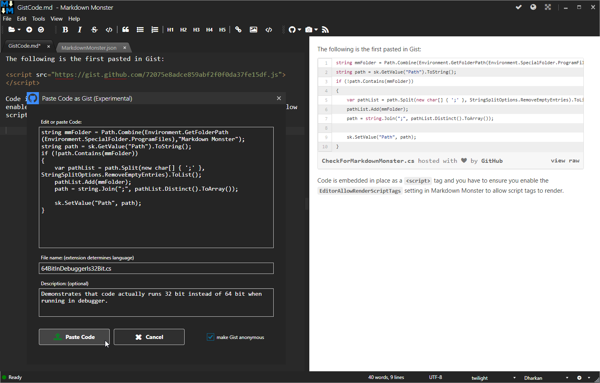

# Paste Code as Gist Markdown Monster Add-in


This project provides a [Markdown Monster](https://markdownmonster.west-wind.com) Add-in for pasting code into a Markdown document based on a Gist that you create and post to Github, and then embed a link to - via `<script>` tag into the Markdown document.



> #### @icon-info-circle EditorAllowRenderScriptTags
> In order for this addin to work you need to enable the **EditorAllowRenderScriptTags** flag in the Markdown Monster settings.

This addin is still a bit rough in its early release and there's no configuration UI. In order to configure the addin credentials if you want to post non-anonymous Gists you can edit the `PasteCodeAsGistAddin.json` file.

```json
{
  "GithubUserToken": "12345e0deb0c66041719d4cc7dec6cd45e",
  "GithubUsername": "RickStrahl"
}
```

### Known Issue: Preview Refresh not showing Gist
Due to the way Markdown Monster refreshes page content efficiently by replacing document content rather than the refreshing the entire page, the Gist script code often doesn't render in the live Preview. The script is there it's just not rendering the partial page reload.

To see the rendered Gist in your content you can:

* Hide then Show the Preview Window (click on the @icon-globe icon in the title bar)
* View in Browser (Alt-v-b)

We'll add an optional flag that will let you run MM in such a way that pages refresh fully each time and all script code in pages executes (which requires a full page refresh).

