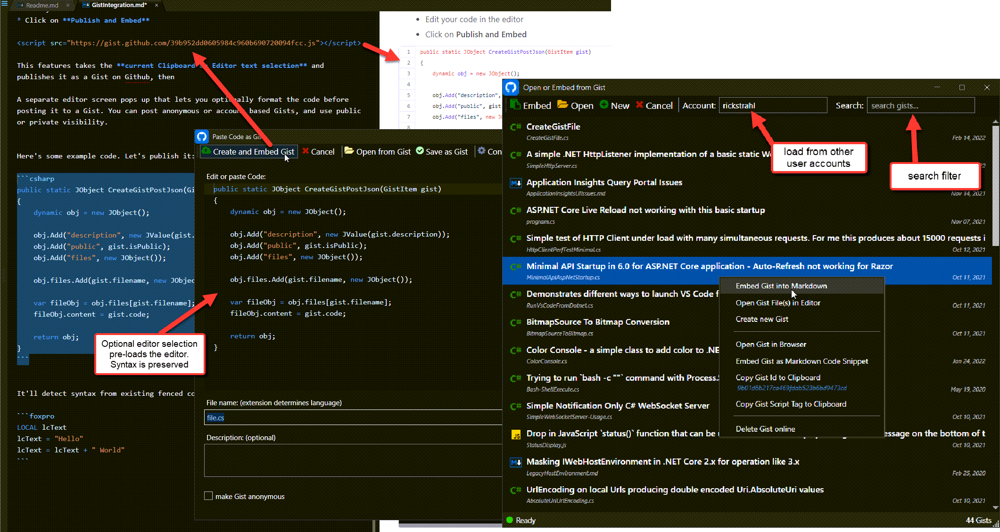
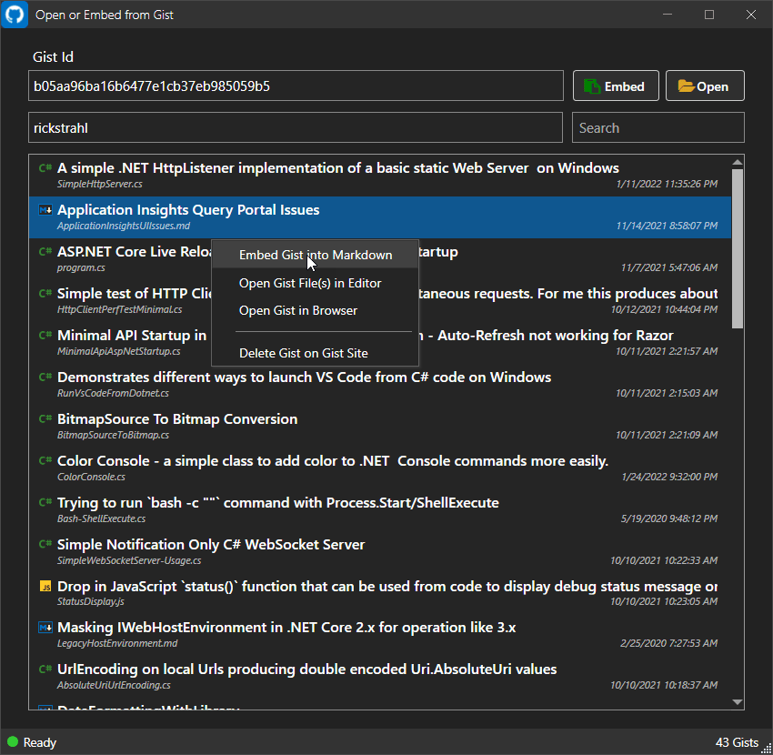
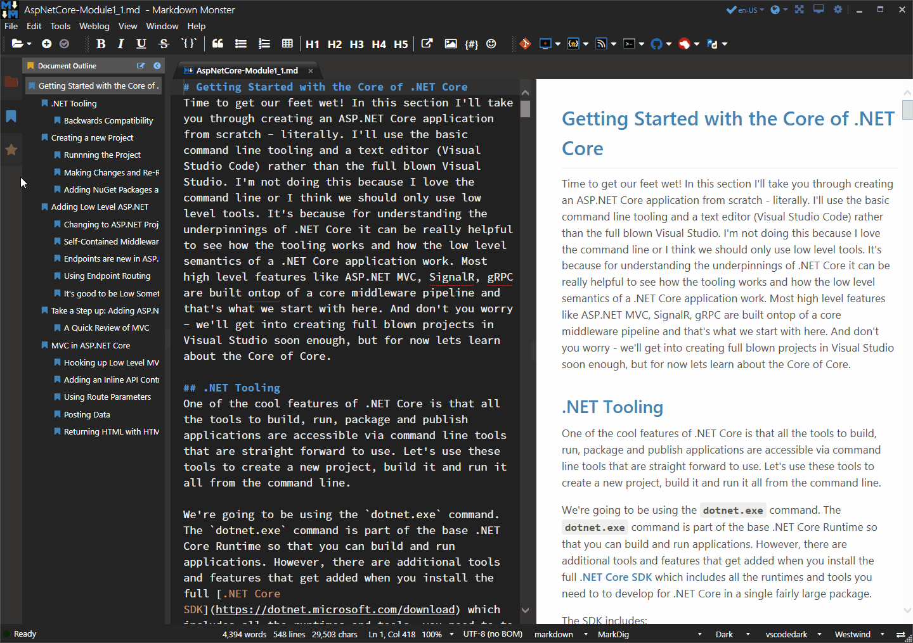

# Gist Integration Markdown Monster Add-in


A [Markdown Monster](https://markdownmonster.west-wind.com) addin that integrates with a few Gist features:

* Capture editor code or create new code, upload as Gist  
and embed into Markdown document
* Select existing Gists and embed into Markdown document
* Open Documents (Narkdown or otherwise) from Gist
* Save Documents (Markdown or otherwise) to Gist
* Delete Gists on Gist Site

> #### Get a GitHub Personal Access Token
> For authentication purposes you need a **Github Personal Access Token**. To create one, go to GitHub, click on your Profile and select Settings. Scroll down to the Developer Settings box and select **Personal Access Tokens**.
> 
> Save the retrieved value in the Gist Integration Addin configuration - click the downarrow next to the addin-icon and select Configuration.
> ```json
> {
>   "GithubUserToken": "12345e0deb0c66041719d4cc7dec6cd45e",
>   "GithubUsername": "JamesUser"
> }
> ```

### Usage for Paste Code as Gist
This features takes the current Clipboard or Editor text selection and pastes it as a Gist on Github. A separate editor screen pops up that lets you optionally format the code before posting it to a Gist. You can post anonymous or account based Gists, and use public or private visibility.

The resulting Gist is then embedded - via `<script>` tag - into the current Markdown document replacing the current selection.

Here's the Paste Code as Gist form that tells the story:



Here's the full set of steps to create and embed a Gist:

* Create some code in the editor
* Align code the way you want it (typically all the way to left)
* Select the code
* *Alternately* copy any external code to your Clipboard
* Click the Gist icon in toolbar
* Your code shows up in the editor
* Assign a filename with the extension that matches your code (ie. C# == MyFile.cs)
* Add an optional description
* Click Paste Code

The addin uses the Gist REST API to post the code to Github. The Gist API creates the Gist and returns a URL to the Gist so you can embed it into the page as an embedded Gist code block.

The embedded code in the markdown creates a `<script>` tag like this:

```html
<script src="https://gist.github.com/35c288114e2cd98e1ca4fd875e7749fe.js"></script>
```

> #### Set *AllowRenderScriptTags: true*
> Markdown Monster by default doesn't allow `<script>` tags to be rendered. Embedded Gists use `<script>` tags and so you **have to** enable script embedding by setting the `AllowRenderScriptTags: true` in the Markdown Monster settings. Goto **Tools -> Settings** and find the **AllowRenderScriptTags** key to set.

## Open from Gist Dialog: Work with existing Gists
The **Open From Gist** dialog allows you to view online Gists and perform a number of tasks on them.

* Embed existing Gists into Markdown
* Open Gists in the editor as a file
* Delete online Gists

To use this dialog:

* Go to **File->Open From**
* Go to **Open or Embed from Gist**


The dialog shows a list of existing Gist, which you can filter by user and an optional keyword search:



### Embedding Existing Gists
The most common thing you're going to use is to embed an existing Gist into a Markdown document. To do this, select the Gist you want to embed and use the context menu (or the Embed Button above) to insert the `<script>` link into the page.

A link is inserted into the page that looks like this:

```html
<script src="https://gist.github.com/810de799ac33e8eba011f96f5e611c02.js"></script>
```

This Github hosted script code injects an `<iframe>` that houses the Gist as a code snippet widget into your Markdown document.

### Usage for Open and Saving Documents from Gists
Open from and Save to Gist UI:



The addin adds two new Menu Options on the **File** menu:

* Open from Gist
* Save to Gist

To open a document from a Gist simply use **Open or embed from Gist**. Use the selection list to pick any Gist you want to load. Alternately you can explicitly type in a Gist Id. The username can be any user name, but it'll default the configuration value for `GithubUsername` in the Addin configuration. You can open Markdown documents or any other kind of code document for editing.

To Save a Document to a Gist use **Save to Gist** while a document is open. You can use the list to select a Gist from the list to update an existing Gist, or check **Save as New Gist** checkbox to create a new Gist with a filename.

> #### File Name Extensions determine Syntax Coloring for Gist
> For new Gists, you should **always** create a filename with an appropriate extension for the file you're saving so the Gist can display with the proper syntax highlighting.

Click the **Save** button to upload your Gist.

### Change Log

#### 0.8.9

* **Add Search Filter to Gist Selection Form**  
Once Gists have loaded you can now filter the list with a search string to find all matching Gists.

* **Retrieve up to the 100 Last Gists**  
Changed the defaults to retrieve up to 100 of the last Gists from Github. 100 is the max for a single list grab and in order to keep the time to load reasonable this is - for now - the max list of Gists that can be loaded. (open to change in the future - it's possible to load up 3000 via paging).

* **Show Gist Count on the Status Bar**  
The number of Gists loaded now show on the status bar.

* **Add Navigation Link to the HTML Gist**  
You can now click on the URL icon in the list to navigate to the HTML Gist Page in your browser to check out the Gist before opening it.