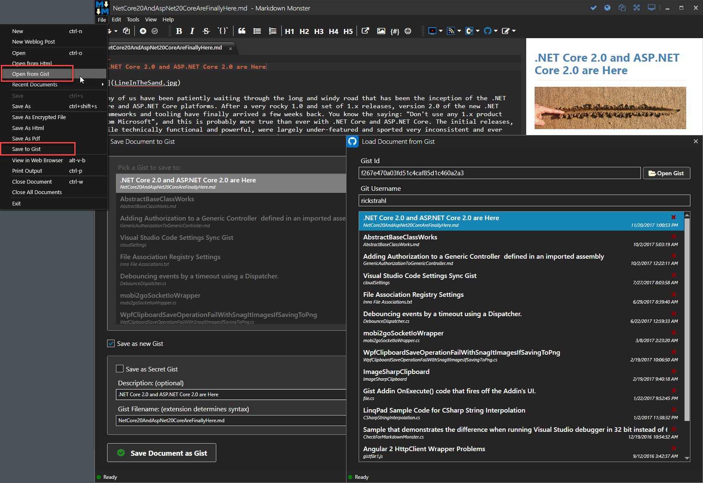

# Gist Markdown Monster Add-in


A [Markdown Monster](https://markdownmonster.west-wind.com) Add-in integrates with a couple of Gist features:

* Paste Code as Gists and Embed them into the Document
* Open Documents (markdown or otherwise) from Gist
* Save Documents (markdown or otherwise) to Gist

that takes the current Clipboard or Editor text selection and pastes it as a Gist on Github. The resulting Gist is then embedded - via `<script>` tag - into the current Markdown document replacing the current selection.

Paste Code as Gist UI:


Open from and Save to Gist UI:




### Usage
Here's the full set of steps to create and embed a Gist:

* Create some code in the editor
* Align code the way you want it (typically all the way to left)
* Select the code
* *Alternately* copy any external code to your Clipboard
* Click the Gist icon in toolbar
* Your code shows up in the editor
* Assign a filename with the extension that matches your code (ie. C# == MyFile.cs)
* Add an optional description
* Click Paste Code

The addin uses the Gist REST API to post the code to Github. The Gist API creates the Gist and returns a URL to the Gist so you can embed it into the page as an embedded Gist code block.

The embedded code in the markdown creates a `<script>` tag like this:

```html
<script src="https://gist.github.com/35c288114e2cd98e1ca4fd875e7749fe.js"></script>
```

> #### Set *AllowRenderScriptTags: true*
> Markdown Monster by default doesn't allow `<script>` tags to be rendered. Embedded Gists use `<script>` tags and so you **have to** enable script embedding by setting the `AllowRenderScriptTags: true` in the Markdown Monster settings. Goto **Tools -> Settings** and find the **AllowRenderScriptTags** key to set.

### Configuration
In order to create new Gists you need to have a **GithubUserToken** and set it in the add-in's configuration. To configure the addin click on the down arrow next to the Gist icon on the toolbar can click **Gist Configuration**. This edits **%AppData%\Markdown Monster\PasteCodeAsGistAddin.json**.

In the file add edit these values:

```json
{
  "GithubUserToken": "12345e0deb0c66041719d4cc7dec6cd45e",
  "GithubUsername": "RickStrahl"
}
```

If the user token isn't set, all gists are posted anonymously without association to your account.
