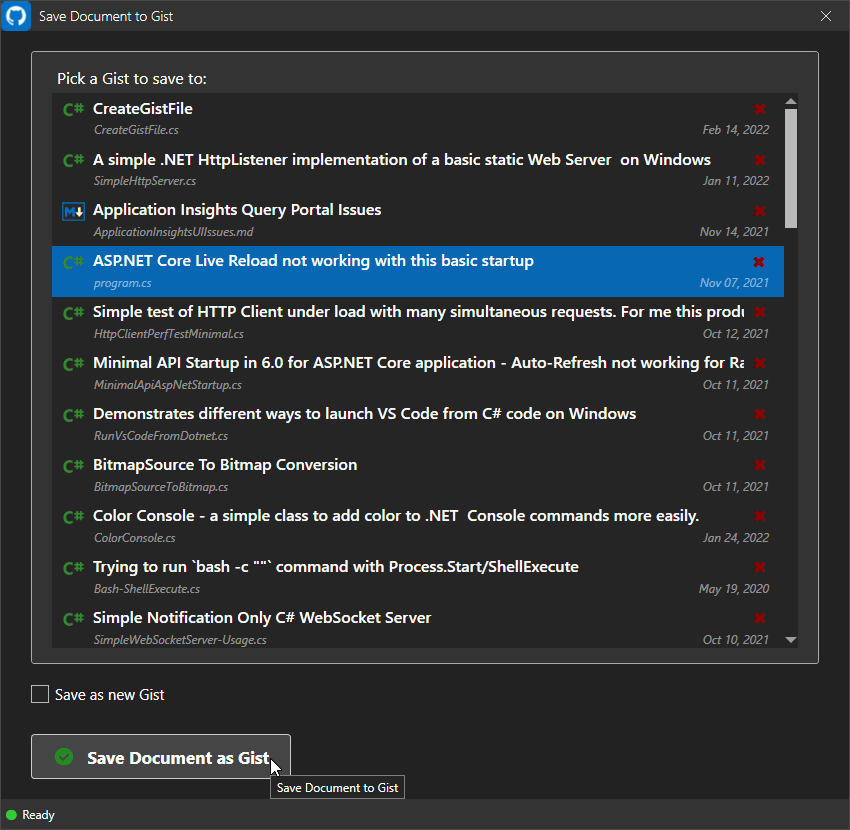

# Gist Integration Markdown Monster Add-in


A [Markdown Monster](https://markdownmonster.west-wind.com) addin that integrates with a few Gist features:

* Capture editor code or create new empty code to upload
* Upload code as Gist and embed into Markdown document
* Select existing Gists and embed into Markdown document
* Select existing Gists and embed as Markdown Code Snippet
* Open Documents (Markdown or otherwise) from Gist
* Save Documents (Markdown or otherwise) to Gist
* Manage Gists  (search filtering, show/embed for other users)
* Delete Gists on Gist Site

> #### Important: Script Rendering has to be enabled for Preview
> In order for Markdown Monster to render embedded Gists in the Previewer, it's necessary to enable the **Allow Script Tags in Markdown Monster** option (`AllowRenderScriptTags` in config file) to allow `<script>` tags to execute. *Without this setting enabled Gists will not render* - the setting is disabled by default.

Here's what a few of the Addin features look like in action:


> #### Get a GitHub Personal Access Token
> For authentication purposes you need a **Github Personal Access Token**. To create one, go to GitHub, click on your Profile and select Settings. Scroll down to the Developer Settings box and select **Personal Access Tokens**.
> 
> Save the retrieved value in the Gist Integration Addin configuration - click the downarrow next to the addin-icon and select Configuration.
> ```json
> {
>   "GithubUserToken": "12345e0deb0c66041719d4cc7dec6cd45e",
>   "GithubUsername": "JamesUser"
> }
> ```


## The User Interface
The user interface for this addin is made up of two separate Windows:

* **The 'Create Gist Code Window'**  
This window is used to create a new Gist and publish and embed it in a single step. 

* **The Gist Manager**
Displays existing Gists in a list along with operations on it: Embedding a Gist in the document, editing in a new editor tab, deleting a Gist and opening a new Gist to create. 

The two options are available from the Toolbar Button drop down:


As well as additional menu options for loading and saving Gists:

* **File->Open From->Open or Embed From Gist**
* **File->Save to->Save to Gist**

### Create New Gist and Publish Window
This window's purpose is to create new Gists and publish it as a Gist.


This feature:

* Picks up current Clipboard or Editor Selection
	* Syntax detection from code to fenced code blocks
	* Normalizes white space stripping leading blanks
	* Or displays an empty editor
* Opens code in editor Window for editing code
* Publishes code to a new Gist
* Embeds `<script>` link to Gist into Markdown document

This features takes the **current Clipboard or Editor text selection** and publishes it as a Gist on Github, then emebds a link to the Gist in the editor.

The addin uses the Gist REST API to post the code to Github. The Gist API creates the Gist and returns a URL to the Gist so you can embed it into the page as an embedded Gist code block.

The embedded code in the markdown creates a `<script>` tag like this:

```html
<script src="https://gist.github.com/35c288114e2cd98e1ca4fd875e7749fe.js"></script>
```

Here's what the rendered result looks like in the editor:


> #### Set *AllowRenderScriptTags: true*
> Markdown Monster by default doesn't allow `<script>` tags to be rendered. Embedded Gists use `<script>` tags and so you **have to** enable script embedding by setting the `AllowRenderScriptTags: true` in the Markdown Monster settings. Goto **Tools -> Settings** and find the **AllowRenderScriptTags** key to set.

## Open from Gist Dialog: Work with existing Gists
The **Open From Gist** dialog allows you to view online Gists and perform a number of tasks on them.

* Embed existing Gists into Markdown
* Embed existing Gists as Markdown fenced Code Snippets
* Open Gists in the editor for editing
* Delete online Gists
* Copy the Id or Script tag for a Gist to the Clipboard

To use this dialog you can use one of these two options:

* Gist Toolbar Dropdown, **Embed or Open existing Gist**
* Go to **File->Open From->Open or Embed from Gist**

The dialog shows a list of existing Gists, which you can filter by Github user account and an optional keyword search:


Once the list is up, you can use the Toolbar buttons or the Context menu to perform the various operations. Double clicking the selection embeds the script tag into the currently active document.


### Editing and Updating Existing Gists
You can use Markdown Monster to edit and update existing Gists:

* Open the **Open or Embed from Gist Window**
* Select a Gist from the List
* Select **Open Gist as file in Editor**

The primary file of the Gist is now opened in a MM editor tab. 

* Make changes to the document
* Use **File->Save To->Save to Gist**
* Select a Gist to save to
* *or* select the **Save as new Gist** checkbox
* for latter enter 

Here's what the dialog looks like for saving where you select a Gist to save to:




Alternately you can create a new Gist from here by checking the **Save as new Gist** checkbox:


### Change Log

#### 0.8.9

* **Add Search Filter to Gist Selection Form**  
Once Gists have loaded you can now filter the list with a search string to find all matching Gists.

* **Retrieve up to the 100 Last Gists**  
Changed the defaults to retrieve up to 100 of the last Gists from Github. 100 is the max for a single list grab and in order to keep the time to load reasonable this is - for now - the max list of Gists that can be loaded. (open to change in the future - it's possible to load up 3000 via paging).

* **Show Gist Count on the Status Bar**  
The number of Gists loaded now show on the status bar.

* **Add Navigation Link to the HTML Gist**  
You can now click on the URL icon in the list to navigate to the HTML Gist Page in your browser to check out the Gist before opening it.