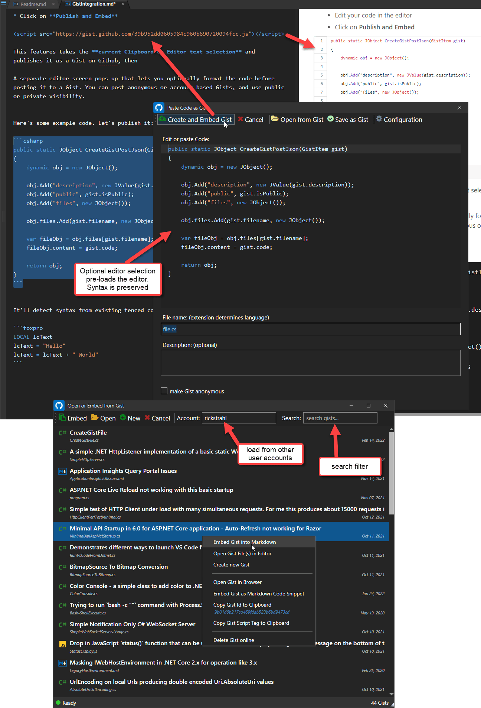

# Paste Code as Gist Markdown Monster Add-in


A [Markdown Monster](https://markdownmonster.west-wind.com) Add-in that takes the current Clipboard or Editor text selection and pastes it as a Gist on Github. The resulting Gist is then embedded - via `<script>` tag - into the current Markdown document replacing the current selection.



### Usage
Here's the full set of steps to create and embed a Gist:

* Create some code in the editor
* Align code the way you want it (typically all the way to left)
* Select the code
* *Alternately* copy any external code to your Clipboard
* Click the Gist icon in toolbar
* Your code shows up in the editor
* Assign a filename with the extension that matches your code (ie. C# == MyFile.cs)
* Add an optional description
* Click Paste Code

The addin uses the Gist REST API to post the code to Github. The Gist API creates the Gist and returns a URL to the Gist so you can embed it into the page as an embedded Gist code block.

The embedded code in the markdown creates a `<script>` tag like this:

```html
<script src="https://gist.github.com/35c288114e2cd98e1ca4fd875e7749fe.js"></script>
```

> #### Set *EditorAllowRenderScriptTags: true*
> Markdown Monster by default doesn't allow `<script>` tags to be rendered. Embedded Gists use `<script>` tags and so you **have to** enable script embedding by setting the `EditorAllowRenderScriptTags: true` in the Markdown Monster settings. Goto **Tools -> Settings** and find the **EditorAllowRenderScriptTags** key to set.

### Configuration
This addin is still a bit rough in its early release and there's no configuration UI. In order to configure the addin credentials if you want to post non-anonymous Gists you can edit the `PasteCodeAsGistAddin.json` file. To find the file go to **Tools -> Open Configuration Folder** and find **PasteCodeAsGistAddin.json**. Inside of this file you can set your Github username and user token to allow posting Gists under your account name:

```json
{
  "GithubUserToken": "12345e0deb0c66041719d4cc7dec6cd45e",
  "GithubUsername": "RickStrahl"
}
```

Alternately you can skip this step and simply post anonymous Gists.